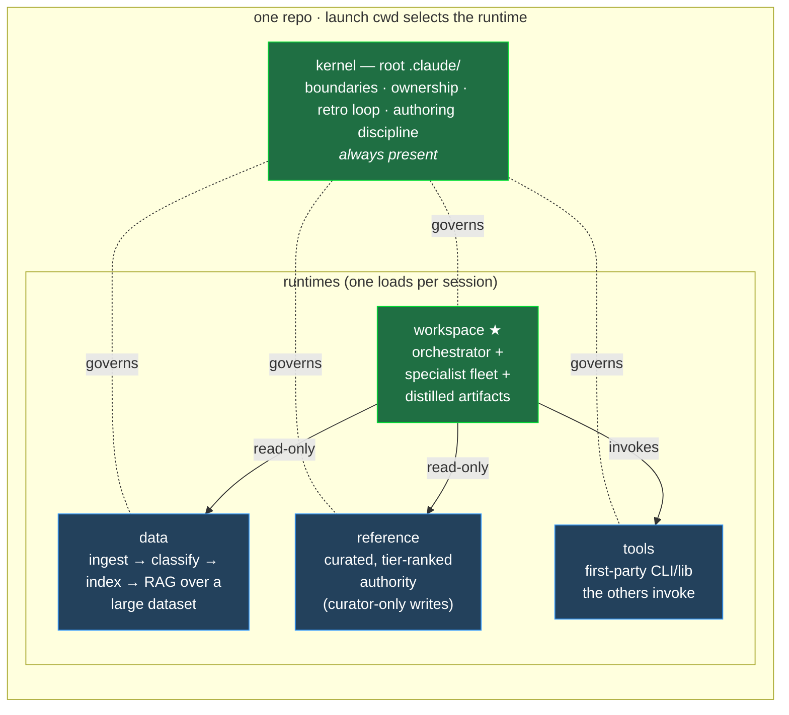

# knowledge-work-runtime

A **Claude Code operating system for specialist knowledge work** — packaged as documentation + drop-in modules you install into any project.

The idea it captures: *a knowledge-work project is a firm of AI specialists sharing one infrastructure* — a principal who orchestrates and produces deliverables, a body of source material to interrogate, a curated authority to cite, and instruments to do it with.

> **New here?** Start with **[`docs/00-overview.md`](docs/00-overview.md)** — the system map with a "read this when…" cue for every other doc. Then skim the [`docs/`](docs/) set; each file is short and single-topic, so you open only what a task needs.

## The one idea

Claude Code reads **exactly one `.claude/` per session**, and which one is decided by the directory you launch from. So instead of one bloated config, this project ships a shared **kernel** plus several mutually-exclusive **runtimes**. `cd` into a runtime and you *are* that runtime — its identity, its agents, its hooks, its rules. No overlay, no merge. Sharing happens through a uniform `<bucket>/` layout and thin symlinks, not duplication.

★ = mandatory. `data`, `reference`, `tools` are optional — add a runtime only when the project actually has that need (a big dataset → `data`; a trusted authority base → `reference`; you build your own CLIs → `tools`).

## What's in the box

| Layer | What | Where |
|---|---|---|
| **Kernel** | The substrate every project gets: `.git`-anchored filesystem boundaries, an area-ownership gate, kernel re-injection (fights post-compaction rule decay), `git-sync` commit-as-you-go, the `/lesson`→`/retro` self-improvement loop, and the `canonical.md` authoring discipline. | `kernel/` |
| **Runtimes** | Templates for the four archetypes — a thin `CLAUDE.md` + a `.claude/` shell each. | `runtimes/` |
| **Frameworks** | The parameterizable engines: a `pipeline` (data), a `doctype-lint` framework (reference), a `schema-lint` engine (workspace). Engine is reusable; content is your config. | `frameworks/` |
| **Apply** | The runbook (and an installable skill) an agent follows to set this up in a target project. | `apply/` |
| **Docs** | Short, single-topic pattern explanations with diagrams — navigable from **[`docs/00-overview.md`](docs/00-overview.md)**, which carries a "read this when…" index. | [`docs/`](docs/) |
| **Catalog** | `manifest.yaml` — every module's install target and parameters. | `manifest.yaml` |

## How you use it

In whatever project you want the OS in, point Claude Code at this repo:

> "Read `github.com/reapp3r/knowledge-work-runtime` and set it up in this project."

The agent reads `manifest.yaml`, follows [`apply/runbook.md`](apply/runbook.md), and installs the kernel + the runtimes your project needs — parameterizing names, taxonomy, schemas, and the agent fleet as it goes.

**Where to read next:** the full architecture lives in [`docs/00-overview.md`](docs/00-overview.md) (your map to all the [`docs/`](docs/)), the install procedure in [`apply/runbook.md`](apply/runbook.md), and the agent contract in [`CLAUDE.md`](CLAUDE.md).

## Status

Early. The kernel lands first; the runtime fleets and the three frameworks land in subsequent passes. `manifest.yaml` marks each module's status (`verbatim` / `scaffold-pending` / `port-pending`) so the applier never installs something that isn't ready.
