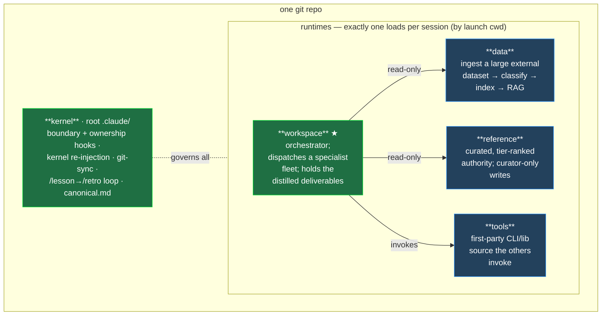
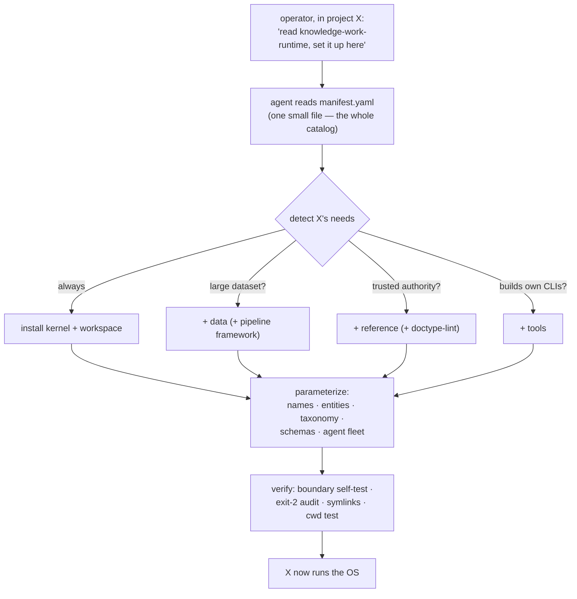

# 00 · Overview — start here

The map of the whole system and the index to the rest of the docs. Every doc is short and single-topic — open the one you need. To *install* the OS into a project, this overview plus [`apply/runbook.md`](../apply/runbook.md) are usually enough; open a deeper topic only when a step points to it.

## The one mechanism: cwd selects the runtime

Claude Code reads **exactly one `.claude/` per session**, found by walking up from the directory you launch in. There is no global config and no overlay/merge. This project turns that constraint into a feature: one repo holds a shared **kernel** plus several mutually-exclusive **runtimes**, and the launch directory decides which runtime you *are* — its identity (`CLAUDE.md`), its agent fleet, its hooks, its rules.

**Sharing without overlays.** The cost of "one `.claude/` only" is duplication. The fix: a uniform `<bucket>/` layout inside every `.claude/` (`rules/<bucket>/`, `memory/agent/<spec>/`, …) plus thin **symlinks**. Shared content lives once under the root `.claude/` and is symlinked into each runtime (`<rt>/.claude/hooks/shared → ../../../.claude/hooks/shared`). Cross-runtime visibility (a curator agent, an ingest skill) is a per-file symlink to the canonical definition. No copy drift.

## The archetypes

| Runtime | Role | Defining property | Status |
|---|---|---|---|
| **workspace** | Orchestrator + distilled artifacts | Dispatches a specialist fleet; produces the deliverables | **Required** |
| **data** | Ingested source dataset | Large, external, read-only, RAG-indexed — *interrogated* | Optional |
| **reference** | Curated authority | Tier-ranked, verified, curator-only writes — *cited* | Optional |
| **tools** | First-party CLI/lib dev | The instruments the others invoke; source co-located with cross-runtime sync discipline | Optional |
| **kernel** | The substrate | Boundaries, ownership, retro, authoring discipline | **Always** |

The split that decides optionality: **`data` is raw material you interrogate; `reference` is trusted authority you cite.** Most domains have one, not both — a research assistant has a corpus but no separate authority; a compliance bot has both (regulations = reference, company docs = data); a coding project may have neither (the codebase is the subject) and just needs `workspace` + `tools`. Only the kernel and `workspace` are mandatory.

## How an agent installs it into your project

The applier works from this overview, the runbook, and the manifest's module list — opening a topic doc only for the pattern it needs. See [`apply/runbook.md`](../apply/runbook.md).

## The docs (open the one you need)

| Doc | Read it when |
|---|---|
| this one | you need the model or don't know where to go |
| 20-runtimes | choosing or scaffolding a runtime |
| 30-boundaries | wiring the boundary / ownership hooks, or the OS sandbox |
| 40-hooks | wiring hooks, exit codes, kernel re-injection, git-sync |
| 50-memory-and-authoring | setting up per-agent memory, or editing any operational content |
| 60-retro-loop | installing the /lesson + /retro improvement loop |
| 70-pipeline | building the `data` runtime's ingest → index → RAG pipeline |

Pending docs are marked in [`manifest.yaml`](../manifest.yaml).

## The disciplines that make it hold together

- **Hook-first enforcement** — anything mechanically checkable is a hook that *blocks* (PreToolUse, **exit code 2** — exit 1 is non-blocking and fails open), not a rule you hope the model remembers. → [40-hooks](40-hooks.md), [30-boundaries](30-boundaries.md)
- **Boundaries are a guardrail, the OS sandbox is the wall** — `boundary_scope.py` catches *accidental* out-of-scope access; pair it with Claude Code's native sandbox for the kernel-enforced boundary. → [30-boundaries](30-boundaries.md)
- **Context is finite** — `CLAUDE.md ≤ 200 lines`, "memory is residue" (the five-place test), kernel re-injection on compaction, hand-rolled per-agent memory. → [50-memory-and-authoring](50-memory-and-authoring.md)
- **The OS improves itself** — `/lesson` (5-sec capture) → `/retro` (mine transcripts → propose rule promotions up a placement ladder → track whether they stick). → [60-retro-loop](60-retro-loop.md)
